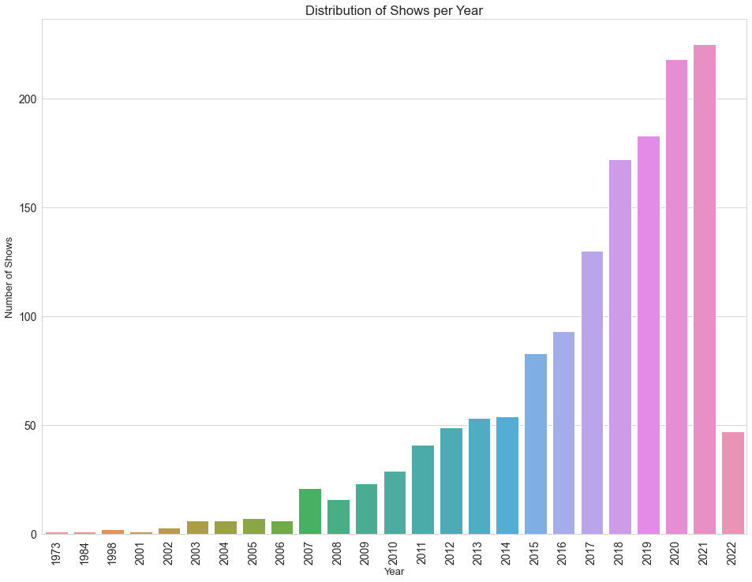

# Jennifer's Portfolio

# [Project 1: Rakuten Viki Data Exploration](https://github.com/JenniferFell1/rakuten_viki.git)   

⬆️ Link to project details above

This project analyzes two datasets containing content information on the streaming website Rakuten Viki. 

* Data was downloaded from Kaggle
* Data cleaning completed in Microsoft Excel
* Data exploration and analysis completed in Jupyter Notebook using Python
* The project write up is published on **Medium

## Distribution of TV shows per Year

